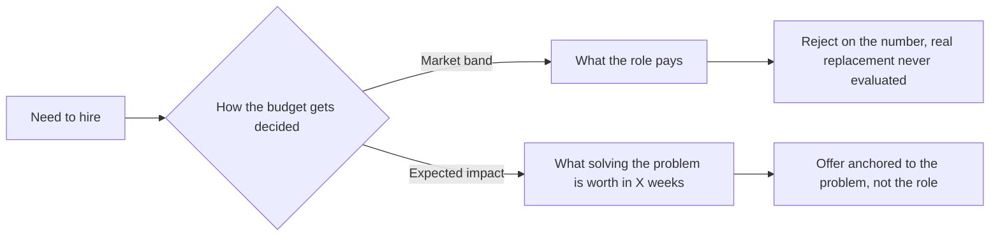

# The Budgeting Mistake That's Quietly Wrecking Your Software Team

**HOOK:** Your team has a production problem: tickets piling up, releases slipping, one senior who's the only person who understands half the system. The obvious move is to hire. But most companies answer that hiring question wrong — and end up stuck with exactly the problem they were trying to fix.

---

## The Question Nobody Asks

A recruiter tells this story: he finds a semi-senior developer earning $4,000 a month. He pitches a move. The candidate says, "For this to make sense, it'd have to be $5,000." The company's answer: "Too high. Pass."

Nobody at that company asked the obvious question.

**Why would someone comfortable, already earning $4,000, leave their current job to keep earning exactly $4,000?**

They wouldn't. Nobody would. Asking for more isn't greed — it's the minimum condition for the move to make sense at all.

But this isn't really a recruiting problem. It's a symptom of something deeper: **the company doesn't know what it's actually buying.**

---

## What a Company Thinks It's Buying, and What It's Actually Buying

When a company builds a hiring budget, it almost always starts with the same question: *what does the market pay for this role?*

That question quietly assumes something: that a developer's work is a commodity. Fungible coding-hours, interchangeable. Under that logic, two people at $3,000 are worth the same as one at $6,000. The numbers add up, the budget closes.

That's the wrong logic.

What a company actually buys isn't time. It's **expected impact within a window** — bugs fixed, features shipped, systems that don't fall over at 3 AM. And that quantity doesn't add up across people. It isn't additive.

---

## Why Impact Doesn't Add Up

There are two reasons, and both are structural — they don't go away no matter how well you hire.

**First: the learning curve can't be parallelized.**

Every project is unique. It has its own architecture, its own historical decisions, its own hidden technical debt buried in some module nobody documented. Learning that takes time — and each person pays that cost individually. Two juniors don't learn the system in half the time one would. They learn it *twice*, in parallel, each paying the full price.

**Second: the impact multiplier varies per person, and it doesn't sum.**

A developer's real impact is a combination of knowledge, energy, experience, and — increasingly — how well they leverage AI tooling. That combination isn't a property of a headcount slot. It's a property of the individual. A senior with a high multiplier can diagnose in an afternoon what two juniors won't solve in a week. Not because they type faster. Because they see the actual problem, not the symptom.

Formally, the math companies use looks like this:

$$
\text{Impact}(\text{team}) = \sum_{i} \text{Impact}(\text{person}_i)
$$

The real math looks more like this:

$$
\text{Impact}(\text{team}) = f(\text{multiplier}_1, \dots, \text{multiplier}_n, \ \text{shared learning curve})
$$

where $f$ isn't a sum — it's a function of how individual multipliers combine, and it's *reduced*, not helped, by a learning curve that every new hire has to pay from zero.

That gap between the two formulas is exactly where hiring budgets quietly bleed out.

---

## The Right Budget Is Measured, Not Negotiated

If impact isn't additive, then "what does the market pay for this role" was never the right question. The right question is:

**How much is it worth, within a fixed window, to solve the specific problem this hire needs to solve?**

That's measurable. Not with interview vibes, but with simple indicators almost any team can already track:

- Tickets resolved per period.
- Downtime avoided or incidents prevented.
- Number of customers or features handled without friction.

The fixed window matters as much as the indicator. It's how you account for the learning curve instead of ignoring it — a hire who takes eight weeks to become productive isn't "cheaper" than one who takes two, even at a lower monthly rate.

The market band answers a question that isn't yours. It tells you what a generic role pays, not what the specific person in front of you is worth for solving *your* problem, in *your* window.

---

## What This Means for Whoever's Hiring

This isn't a call to "pay more." It's a call to **measure differently**.

Rejecting a salary ask because it beats the market band, without asking what impact that person brings within your window, isn't protecting yourself from a cost — it's rejecting information.

Sometimes that person is, in practice, the cheapest option on the market: they solve in weeks what two "within-band" hires would solve in months, if they solve it at all. The hourly rate never tells that part of the story.

And there's a natural consequence of thinking this way that deserves its own piece: if impact isn't additive across people, the most efficient way to build a team in the AI era isn't stacking more people at the same level — it's pairing junior and senior developers where each one multiplies the other. But that's a different story.

For now, the next time a candidate asks for "more than the band says," the question worth asking isn't *how much do they cost*. It's *how much is what they solve actually worth*.
