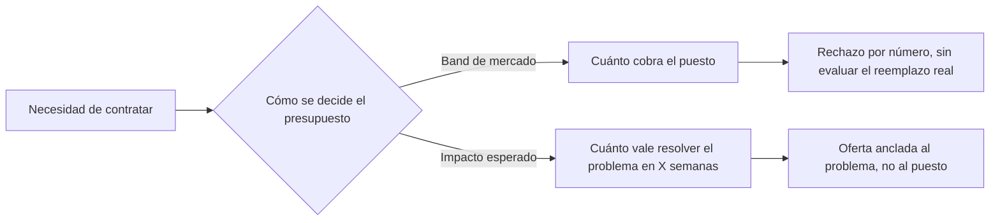

# El Error de Presupuesto Que Está Destruyendo Tu Equipo de Software

**HOOK:** Tu equipo tiene un problema de producción: tickets que se acumulan, releases que se atrasan, un senior que es el único que entiende medio sistema. La solución obvia es contratar. Pero la mayoría de las empresas resuelve esa contratación con la pregunta equivocada — y por eso se quedan justo con el problema que querían resolver.

---

## La Pregunta Que Nadie Se Hace

Un reclutador cuenta esta historia: encuentra un semi-senior que hoy gana USD 4.000. Le ofrece un cambio. El candidato dice: "Para moverme, USD 5.000." La empresa responde: "Muy alto. Descartado."

Nadie en esa empresa se hizo la pregunta obvia.

**¿Por qué alguien cómodo, ganando USD 4.000, dejaría su trabajo actual para seguir ganando exactamente USD 4.000?**

No lo haría. Nadie lo haría. Pedir más no es codicia — es la condición mínima para que el cambio tenga sentido.

Pero esto no es un problema de reclutamiento. Es un síntoma de algo más profundo: **la empresa no sabe qué es lo que realmente está comprando.**

---

## Qué Cree Comprar una Empresa, y Qué Compra en Realidad

Cuando una empresa arma un presupuesto de contratación, casi siempre empieza por la misma pregunta: *¿cuánto paga el mercado por este puesto?*

Esa pregunta asume algo silenciosamente: que el trabajo de un developer es un commodity. Tiempo de código, fungible, intercambiable. Bajo esa lógica, dos personas a USD 3.000 valen lo mismo que una a USD 6.000. Sumás los números y el presupuesto cierra.

Es la lógica equivocada.

Lo que una empresa realmente compra no es tiempo. Es **impacto dentro de un plazo** — bugs resueltos, features enviadas, sistemas que no se caen a las 3 AM. Y esa magnitud no se suma entre personas. No es aditiva.

---

## Por Qué el Impacto No Se Suma

Hay dos razones, y las dos son estructurales — no dependen de qué tan bien contrates.

**Primera: la curva de aprendizaje no se paraleliza.**

Cada proyecto es único. Tiene su propia arquitectura, sus propias decisiones históricas, su propia deuda técnica escondida en algún módulo que nadie documentó. Aprender eso toma tiempo — y ese tiempo lo paga *cada persona*, individualmente. Dos juniors no aprenden el sistema en la mitad de tiempo que uno solo. Aprenden el sistema *dos veces*, en paralelo, cada uno pagando el costo completo.

**Segunda: el multiplicador de impacto varía por persona, y no se suma.**

El impacto real de un developer es una combinación de conocimiento, energía, experiencia y, cada vez más, cuánto sabe apalancar herramientas de IA. Esa combinación no es una propiedad de la plantilla — es una propiedad de la persona. Un senior con ese multiplicador alto puede diagnosticar en una tarde un problema que dos juniors no resuelven en una semana. No porque trabaje más rápido línea por línea. Porque ve el problema real, no el síntoma.

Formalmente, la matemática que las empresas usan es esta:

$$
\text{Impacto}(\text{equipo}) = \sum_{i} \text{Impacto}(\text{persona}_i)
$$

Y la matemática real se parece más a esto:

$$
\text{Impacto}(\text{equipo}) = f(\text{multiplicador}_1, \dots, \text{multiplicador}_n, \ \text{curva de aprendizaje compartida})
$$

donde $f$ no es una suma — es una función que depende de cómo se combinan los multiplicadores individuales, y que se ve *reducida*, no ayudada, por una curva de aprendizaje que cada persona nueva vuelve a pagar desde cero.

Esa diferencia entre las dos fórmulas es exactamente donde se pierde el presupuesto de contratación.

---

## El Presupuesto Correcto se Mide, No se Negocia

Si el impacto no es aditivo, entonces "cuánto paga el mercado por este puesto" nunca fue la pregunta correcta. La pregunta correcta es:

**¿Cuánto vale, en un plazo fijo, resolver el problema que este hire tiene que resolver?**

Eso se puede medir. No con vibras de entrevista, sino con indicadores simples que casi cualquier equipo ya puede rastrear:

- Tickets resueltos por período.
- Tiempo de desconexión o incidentes evitados.
- Número de clientes o features atendidos sin fricción.

El plazo fijo importa tanto como el indicador. Es la forma de contabilizar la curva de aprendizaje en vez de ignorarla — un hire que tarda ocho semanas en ser productivo no es "más barato" que uno que tarda dos, aunque cobre menos por mes.

El band de mercado responde una pregunta que no es la tuya. Te dice cuánto cobra un puesto genérico, no cuánto vale la persona que tenés al frente para resolver *tu* problema, en *tu* plazo.

---

## Lo Que Esto Significa Para Quien Contrata

Esto no es un llamado a "pagar más". Es un llamado a **medir distinto**.

Rechazar un pedido de sueldo porque supera el band de mercado, sin preguntar qué impacto trae esa persona en el plazo que necesitás, es rechazar información — no protegerte de un costo.

A veces esa persona es, en los hechos, la opción más barata del mercado: resuelve en semanas lo que dos contrataciones "dentro de band" resolverían en meses, si es que lo resuelven. El precio por hora nunca cuenta esa parte de la historia.

Y hay una consecuencia natural de pensar así que merece su propio análisis: si el impacto no es aditivo entre personas, la forma más eficiente de construir equipo en la era de la IA no es apilar más gente al mismo nivel — es combinar duplas junior-senior donde cada uno multiplica al otro. Pero esa es otra historia.

Por ahora, la próxima vez que un candidato pida "más de lo que dice el band", la pregunta que vale la pena hacerse no es *cuánto cobra*. Es *cuánto vale lo que resuelve*.
