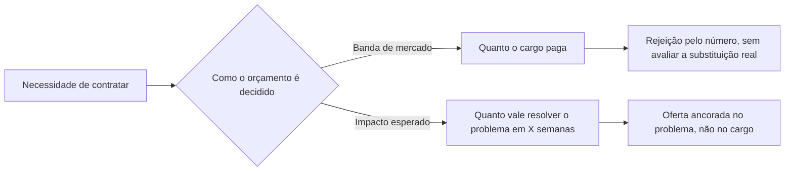

# O Erro de Orçamento Que Está Destruindo Seu Time de Software

**HOOK:** Seu time tem um problema de produção: tickets se acumulando, releases atrasando, um sênior que é a única pessoa que entende metade do sistema. A solução óbvia é contratar. Mas a maioria das empresas resolve essa contratação com a pergunta errada — e acaba ficando exatamente com o problema que queria resolver.

---

## A Pergunta Que Ninguém Faz

Um recrutador conta essa história: encontra um semi-sênior que hoje ganha USD 4.000. Oferece uma mudança. O candidato diz: "Para eu me mover, teria que ser USD 5.000." A resposta da empresa: "Muito alto. Descartado."

Ninguém naquela empresa fez a pergunta óbvia.

**Por que alguém confortável, ganhando USD 4.000, deixaria o emprego atual para continuar ganhando exatamente USD 4.000?**

Não deixaria. Ninguém deixaria. Pedir mais não é ganância — é a condição mínima para que a mudança faça sentido.

Mas isso não é um problema de recrutamento. É sintoma de algo mais profundo: **a empresa não sabe o que está realmente comprando.**

---

## O Que uma Empresa Acha Que Compra, e o Que Compra de Verdade

Quando uma empresa monta um orçamento de contratação, quase sempre começa pela mesma pergunta: *quanto o mercado paga por esse cargo?*

Essa pergunta assume algo silenciosamente: que o trabalho de um desenvolvedor é uma commodity. Tempo de código, fungível, intercambiável. Nessa lógica, duas pessoas a USD 3.000 valem o mesmo que uma a USD 6.000. Os números fecham, o orçamento fecha.

É a lógica errada.

O que uma empresa realmente compra não é tempo. É **impacto esperado dentro de um prazo** — bugs resolvidos, features entregues, sistemas que não caem às 3 da manhã. E essa grandeza não se soma entre pessoas. Não é aditiva.

---

## Por Que o Impacto Não Se Soma

Há duas razões, e as duas são estruturais — não desaparecem por mais bem que você contrate.

**Primeira: a curva de aprendizado não se paraleliza.**

Cada projeto é único. Tem sua própria arquitetura, suas próprias decisões históricas, sua própria dívida técnica escondida em algum módulo que ninguém documentou. Aprender isso leva tempo — e esse tempo é pago por *cada pessoa*, individualmente. Dois juniors não aprendem o sistema na metade do tempo que um levaria. Aprendem o sistema *duas vezes*, em paralelo, cada um pagando o custo inteiro.

**Segunda: o multiplicador de impacto varia por pessoa, e não se soma.**

O impacto real de um desenvolvedor é uma combinação de conhecimento, energia, experiência e, cada vez mais, o quanto sabe aproveitar ferramentas de IA. Essa combinação não é propriedade do cargo — é propriedade da pessoa. Um sênior com esse multiplicador alto pode diagnosticar numa tarde um problema que dois juniors não resolvem numa semana. Não porque digita mais rápido. Porque enxerga o problema real, não o sintoma.

Formalmente, a matemática que as empresas usam é esta:

$$
\text{Impacto}(\text{time}) = \sum_{i} \text{Impacto}(\text{pessoa}_i)
$$

E a matemática real se parece mais com isto:

$$
\text{Impacto}(\text{time}) = f(\text{multiplicador}_1, \dots, \text{multiplicador}_n, \ \text{curva de aprendizado compartilhada})
$$

onde $f$ não é uma soma — é uma função de como os multiplicadores individuais se combinam, e que é *reduzida*, não ajudada, por uma curva de aprendizado que cada nova contratação paga do zero.

Essa diferença entre as duas fórmulas é exatamente onde o orçamento de contratação vaza.

---

## O Orçamento Certo Se Mede, Não Se Negocia

Se o impacto não é aditivo, então "quanto o mercado paga por esse cargo" nunca foi a pergunta certa. A pergunta certa é:

**Quanto vale, dentro de um prazo fixo, resolver o problema que essa contratação precisa resolver?**

Isso é mensurável. Não com sensação de entrevista, mas com indicadores simples que quase qualquer time já consegue rastrear:

- Tickets resolvidos por período.
- Tempo de indisponibilidade ou incidentes evitados.
- Número de clientes ou features atendidos sem fricção.

O prazo fixo importa tanto quanto o indicador. É a forma de contabilizar a curva de aprendizado em vez de ignorá-la — uma contratação que leva oito semanas para ser produtiva não é "mais barata" que uma que leva duas, mesmo cobrando menos por mês.

A banda de mercado responde uma pergunta que não é sua. Diz quanto paga um cargo genérico, não quanto vale a pessoa à sua frente para resolver *o seu* problema, no *seu* prazo.

---

## O Que Isso Significa Para Quem Contrata

Isso não é um chamado para "pagar mais". É um chamado para **medir diferente**.

Rejeitar um pedido salarial porque supera a banda de mercado, sem perguntar qual impacto essa pessoa traz dentro do seu prazo, não é se proteger de um custo — é rejeitar informação.

Às vezes essa pessoa é, na prática, a opção mais barata do mercado: resolve em semanas o que duas contratações "dentro da banda" resolveriam em meses, se resolverem. O valor por hora nunca conta essa parte da história.

E há uma consequência natural de pensar assim que merece seu próprio texto: se o impacto não é aditivo entre pessoas, a forma mais eficiente de construir um time na era da IA não é empilhar mais gente no mesmo nível — é combinar duplas junior-sênior onde cada um multiplica o outro. Mas essa é outra história.

Por enquanto, da próxima vez que um candidato pedir "mais do que diz a banda", a pergunta que vale a pena fazer não é *quanto custa*. É *quanto vale o que essa pessoa resolve*.
